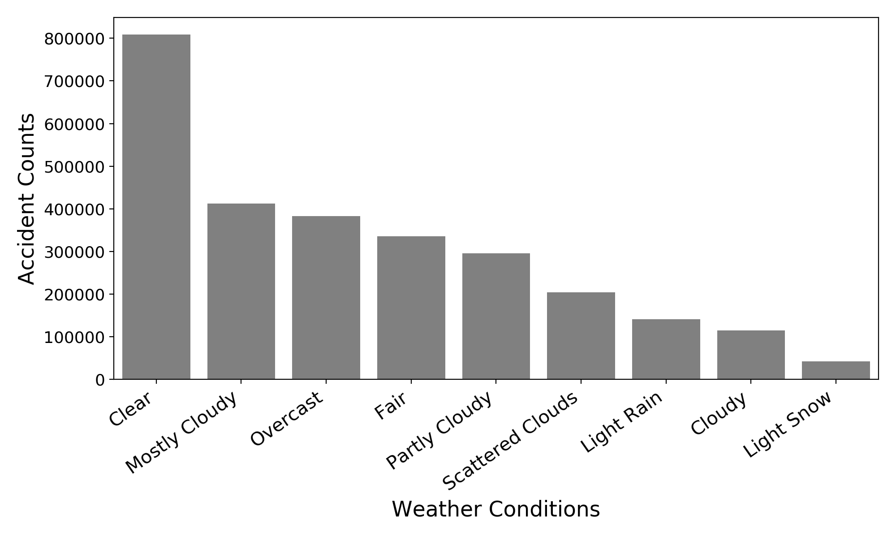
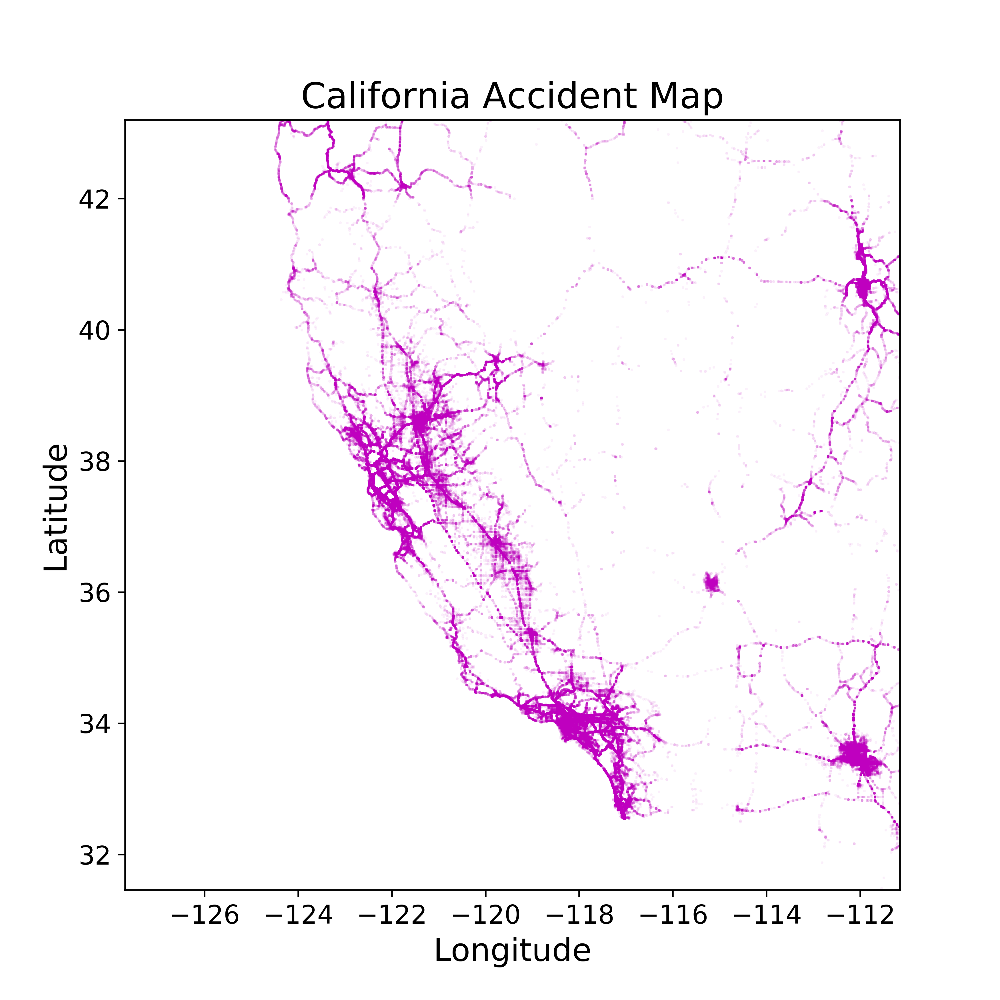
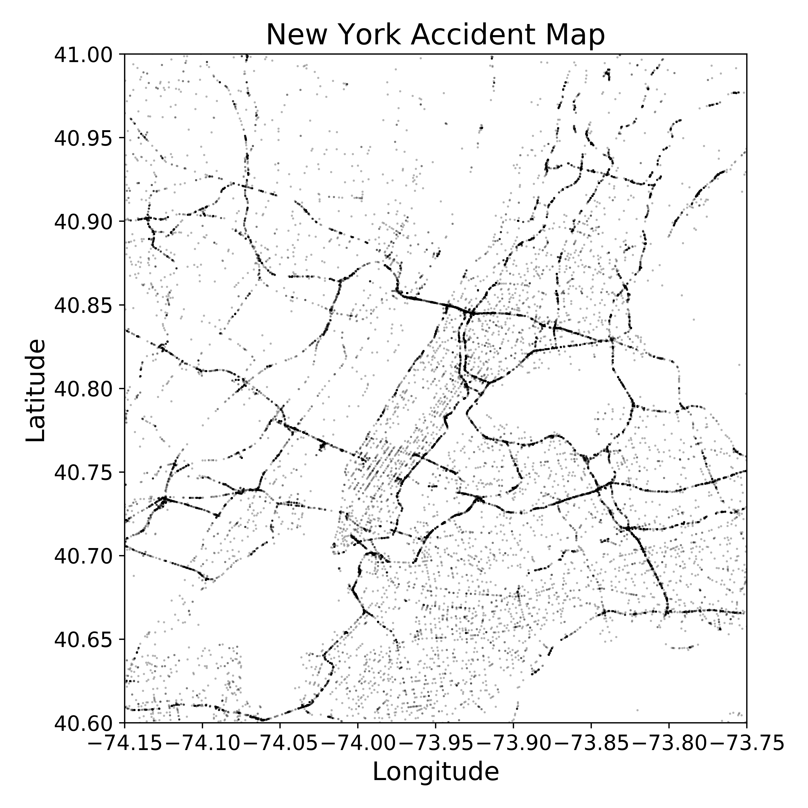
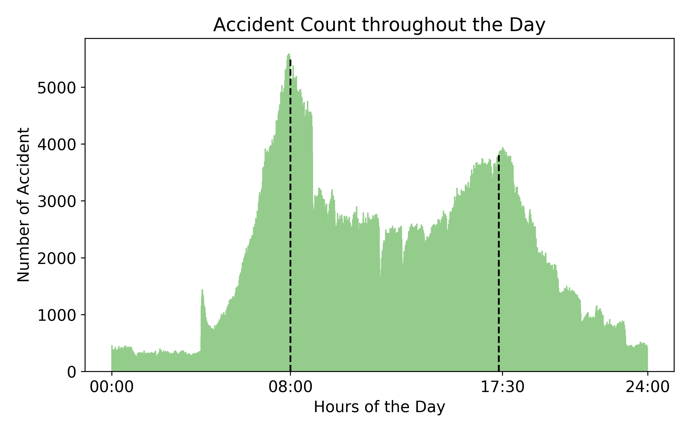

*Capstone I Project for Galvanize Data Science Immersive, Week 4*

*by Marc Russell*

# Car Accidents Analysis

  

## Effects of Location, Weather, and Time on Accident Rate and Severity in the United States

## Table of Contents
- [Introduction](#introduction)
  - [Background](#background)
  - [The Data](#the-data)
  - [Question and Hypothesis](#question-and-hypothesis)
  - [Methodology](#methodology)
- [Exploratory Data Analysis](#exploratory-data-analysis)
- [Hypothesis Test](#hypothesis-test)
  - [Feature Selection](#feature-selection)
  - [Results and Interpretation](#results-and-interpretation)
- [Conclusion](#model-selection)
- [Citation](#citation])

# Introduction

## Motivation

Through analysis and 

## The Data

The car accident dataset has been collected in real-time, using multiple Traffic APIs. It contains car accident data that is collected from February 2016 to December 2019 for the Contiguous United States. By using several data providers such as the US and state departments of transportation, law enforcement agencies, traffic cameras, and traffic sensors within the road-networks, the authors1 were able to construct about 3 million detailed accident records. This comprises somewhere between 10% and 50% of the total number of accidents in the US during that timespan.

The population dataset was an annual report given out by the IRS which describes precisely the number and amounts of many tax details including income, population, etc. for each US Zipcode.
 

## Question and Hypothesis

How does weather (temperature, wind, precipitation, visibility, etc.) effect accident rates?

What are the safest states to drive in? Are there any relations between safe-states?

Do neighborhoods with high education taxes have lower accident rates?

Are accident rates lower in towns with more farms?

How does uneployment effect accident rates?

How does number of retirees effect accident rates?

Do higher income neighborhoods have lower accident rates?

MVP
1. Hypothesis test - State vs State - find best/worst - Weather
2. Maps, heatmaps, and geo data
3. Combine tax datasets to discover relations between income/education/unemployment/farms and accident rates

[Back to Top](#Table-of-Contents)

# Exploratory Data Analysis

## Groups

Accident Dataset:
 - 49 columns and 3 million rows
 - Each row is an accident event
 
IRS Dataset:
 - 153 columns and 1 million rows
 - Each Zipcode has 6 rows (one for each income division)

## Feature Categories

* Accident Results:

       Accident Counts (rows), Severity, Length of Road Effected, Description

* Weather:

      Temperature, Weather Condition, Precipitation, Visibility

* Road Attributes:

      Nearby Traffic Signs (Yield, Stop, etc.), Railroads, Speed Bumps, Merges
      
* Geo-positional:

      Latitude, Longitude, State, County, City, Zipcode

## Exploration

### _Weather_

#### Weather Condition: 
A naive analysis of how the weather conditions relate to accident counts would show that there is no significant increase in accident counts during precipitation. By plotting a histogram of the weather condition counts we don't take into consideration that weather conditions are not identically distributed. 
For example, if it doesn't snow often but there is a high accident rate when it snows, then we will not be able to see this be only observing the accident counts; the snow-accidents are eclipsed by the large number of non-snow-accidents.

  

#### Temperature: 
Does temperature correlate with number of accidents? Is there a spike below 32oF?

  

Comparing temperature to the number of accidents showed no significant increase at 32o F. The plot seems to have a right scew which further backs our assumtion earlier - the data is not independent and identically distributed over all temperatures.

#### Precipitation: 
Taking a look at the precipitation amount against the number of accidents we notice two areas of interest. 

  

For small amounts of precipitation, we notice a steep decline as precipitation increases. For precipitation near 10 inches per hour we see a significant increase in accident counts. This is likely a result of the human psychological tendancy to prefer 'round' numbers; this is often refered to as 'round number bias'.

#### Visibility: 
Does visibility negatively correlate with number of accident?

  

No, there may be a positive correlation but it is inconclusive.

The weather data proved difficult to adjust due to underlying data distributions. An example from above is how weather conditions distribute themselves. If this distribution in not uniform, or if we do not subtract it out, we will not be able to obtain meaningful results. With this in mind, I moved onto other features that I knew I could eleminate their underlying distributions.

### __Location__

The locations of each accident were precisesly recorded using geo-positional data (latitude and logitude). These locations allowed for easy mapping of the national roads. Below you can see some heat-map style accident-maps on some popular U.S. areas.

  
  
  

#### State:
I quickly became interested in comparing accident counts between states to determine the most and least 'dangerous' states to drive in.  To avoid the naive mistakes mentioned above we will be adjusting the accident counts. One way to adjust the number-of-accidents-per-state is to divide by the state population. This is the approach I will be taking below. 

It's important to distinguish the difference before and after the adjustment on number of accidents. The 'unadjusted' graphs below represent the number of accidents for each state over 3.5 years. These values are weighted since each state has a different number of drivers. To remove this population-bias we can divide each state's number of accidents by the population of that state (assumed to be proportional to the # of drivers); dividing by 3.5 will give us a per-year rate. After these adjustment, our value represents the number of accidents per person per year in each state; we will refer to as the *accident rate* from now on.

  

Top-left notice how California's large population outweighs South Carolina's number of accidents despite there being a lower accident rate in California.

Next I took a more fine grain look at the accident rates around the contiguous United States. This time on a city/neighborhood level. It became aparent that county and city names in the United States are not unique. In an effort to maintain an independent and identically distributed dataset, I chose to work with Zipcodes. In the U.S., Zipcodes *are* unique and are often more 'fine grain' than city names; a single city may have several Zipcodes, one for each nieghborhood within the city.

I obtained an IRS dataset that allowed me to adjust accident counts per Zipcode by dividing by that Zipcode's population. In addition this allowed me to look at the relationship between income, education expense, unemployment rate, number of farms to the accident rate.

### __Time__:

Let's take a look at how accident counts change throughout the day. 

  

As we expected there are two peaks in accident counts, one for each 'rush hour'. Let's instead look at how accident counts change over large time scales.

Plotting over the entire year of 2017 there are two features that stand out. There are many short-term fluctuation as well as a single, longer-term increase in accident counts. The long term fluctuation occurs near the fall equinox. One cause of this could be wet leaves on the roads - a serious hazard.

  

Let's examine the shorter-term fluctuations. If we were to count the peaks or valleys, we would find that there are about 52 - suggesting that it is weekly.

  

[Back to Top](#Table-of-Contents)

# Hypothesis Test

## Feature Selection
    1. Full model yrewhju34
    2. Secondary masdfhwerh
    3. Third masdfasdf
## Results and Interpretation
vfgsfdgs

[Back to Top](#Table-of-Contents)

# Conclusion
I initally wanted to focus my study on how weather conditions effect accident rates. It turned out that adjusting my data to account for the fact that is not independent and identically distributed proved difficult. To remedy this, I would source a dataset of locational-hourly-weather and merged with the accident data set. Instead I shifted focus to locational and temporal relationships to accident rates.

I found the relationships between state accident rates very interesting.

[Back to Top](#Table-of-Contents)

# Citation
*Moosavi, Sobhan, Mohammad Hossein Samavatian, Srinivasan Parthasarathy, and Rajiv Ramnath. “A Countrywide Traffic Accident Dataset.”, 2019.*

*Moosavi, Sobhan, Mohammad Hossein Samavatian, Srinivasan Parthasarathy, Radu Teodorescu, and Rajiv Ramnath. "Accident Risk Prediction based on Heterogeneous Sparse Data: New Dataset and Insights." In proceedings of the 27th ACM SIGSPATIAL International Conference on Advances in Geographic Information Systems, ACM, 2019.*

*http://worldpopulationreview.com/states/*

*USDA Economic Research Service. (2020). Atlas of Rural and Small-Town America. Ag Data Commons. https://data.nal.usda.gov/dataset/atlas-rural-and-small-town-america. Accessed 2020-04-08.*

*Photo by Jeremy Bishop on Unsplash*

*Photo by sergio souza on Unsplash*

*National Center for Statistics and Analysis. (2017, October). 2016 fatal motor vehicle crashes: Overviewexternal icon. (Traffic Safety Facts Research Note. Report No. DOT HS 812 456). Washington, DC: National Highway Traffic Safety Administration.*

[Back to Top](#Table-of-Contents)
